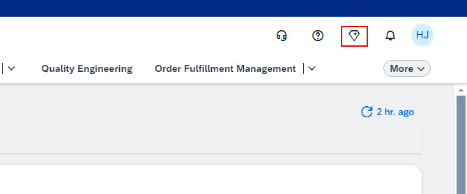
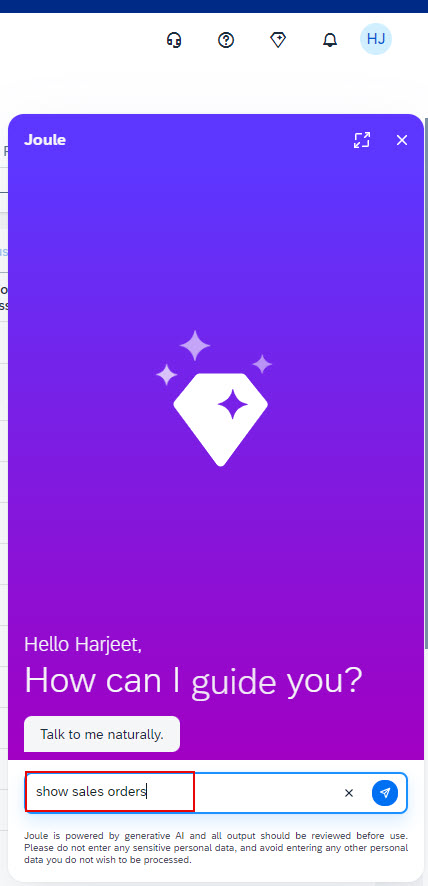
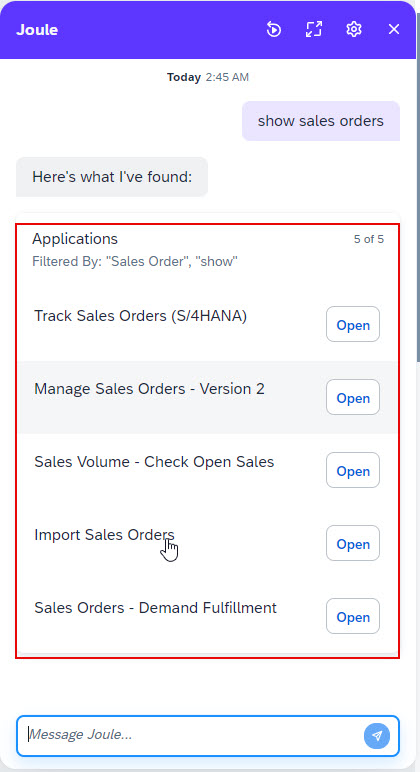

For a complete list of supported use cases, see [3545050 - List of Business Objects Enabled for Joule in SAP S/4HANA Cloud Public Edition](https://me.sap.com/notes/3545050)
1. Access your SAP S/4HANA Cloud Public Edition System and the click the **Joule** icon. 

2. Type a query such as **"show sales orders"**. 

3. Ensure that Joule responds with appropriate information based on your query. 

