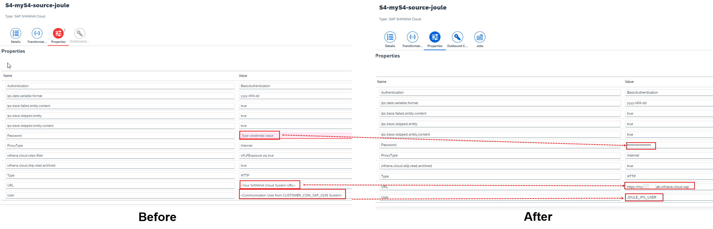
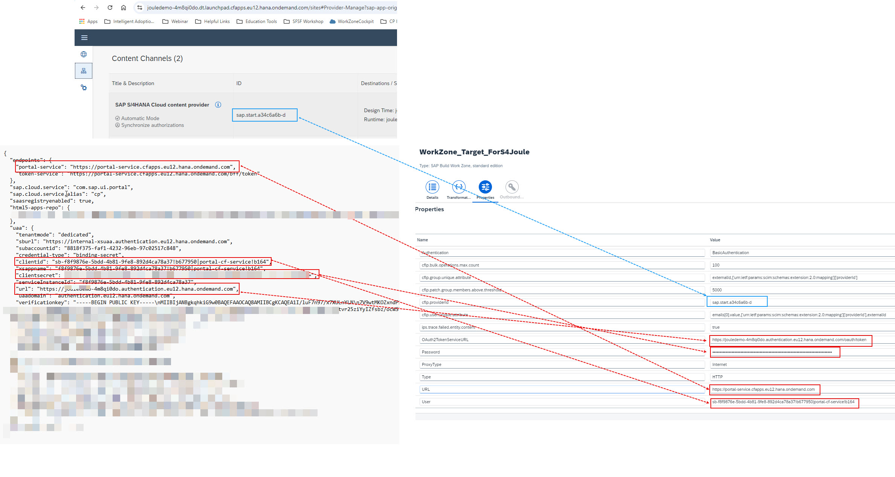

## **Configure SuccessFactors as Source System in Identity Provisioning**

1. Download [**IdentityProvisioningFilesS4C.zip**](https://github.com/hjudgesac/joule_integration_sfsf_public/raw/main/configure_identity_provisioning/files/IdentityProvisioningFiles.zip) that contains the pre-defined source and target systems required to setup this configuration. 
**Note**: A file should be automatically downloaded into your downloads folder.
2. Extract the zip file into a folder of your choice.  Confirm that the following 2 files are visible in the extracted folder:
   * **S4-myS4-source-joule.json**
   * **WorkZone_Target_ForS4Joule.json** 

3. Access the administration console of SAP Cloud Identity Services tenant using one of the URL formats below:
  * https://your-ias-tenant.accounts.ondemand.com/admin
  * https://your-ias-tenant.accounts.cloud.sap/admin              
  **Note**: Substitute your-ias-tenant with your actual tenant's name.
4. Authenticate using an administrator user.                 

5. From the menu, access **Identity Provisioning >> Source Systems**. 

6. Under **Source Systems** click **+Add** icon. 

7. Click **Browse** to import a pre-defined source system configuration. 

8. Select the **S4-myS4-source-joule.json** file downloaded earlier and click **Open**.

9. Update **myS4** portion in the **System Name** field to reflect your S/4HANA instance and click **Save**. 

10. Click on **Properties** and replace the placeholder values with appropriate values for your setup using the information below:
  * **URL** : Specify your S/4HANA Cloud URL.  For e.g. https://myXXXXXX.s4hana.cloud.sap.
  * **User** : Specify the Communication User created in earlier steps.  For eg. JOULE_IPS_USER
  * **Password**: Password of the Communication User.            
 
  

11. Click **Save**.

## **Configure SAP Build Work Zone, standard edition as a target system in Identity Provisioning**

1. From the menu, access **Identity Provisioning >> Target Systems**.       

2. Under **Target Systems** click **+Add** icon.                  

3. Click **Browse** to import a pre-defined target system configuration.
4. Select the **WorkZone_Target_ForS4Joule.json** file downloaded earlier and click **Open**.       

5. From the **Source System** dropdown make sure to select the source system created earlier.  For e.g. **S4-myXXXXX-source-joule**.   

6. Switch to the **Properties** tab and update the following placeholders with the appropriate values for your system:
 * **cflp.providerId**: <-- **ID** of the S/4 content provider created in Work Zone by the Joule booster. -->
 * **URL**: <--**portal-service** url from the key file downloaded earlier when we create Work Zone instance in BTP-->
 * **OAuth2TokenServiceURL**: <--**url** field from the key file downloaded earlier.  Make sure to add **/oauth/token** to end of the URL-->
 * **User**: <--**clientid** from key file downloaded earlier-->
 * **Password**: <--**clientsecret** from key file downloaded earlier--> 
 
 
 7. Click **Save**.
 * Certificate File: Upload the certificate file downloaded from the SuccessFactors source system we created in earlier steps.
 * Login Name: <--Leave blank--> 

8. Confirm the certificate is successfully uploaded in SuccessFactors.               

