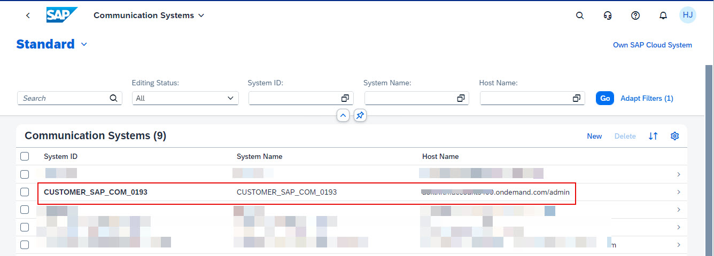

6. Under Communication Systems, select the communication system with the name **CUSTOMER_SAP_COM_0193**.  This system should already be available in your SAP S/4HANA Cloud Public Edition system. 

7. Click the **Edit** button. 

8. Under **Users for Inbound Communication**, click **+** button.

9. Click **New User** button. 

