1. If necessary, access **Communication Systems** application. 
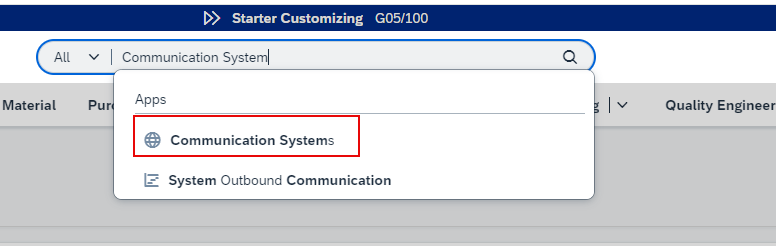

2. Click the **New** button. 
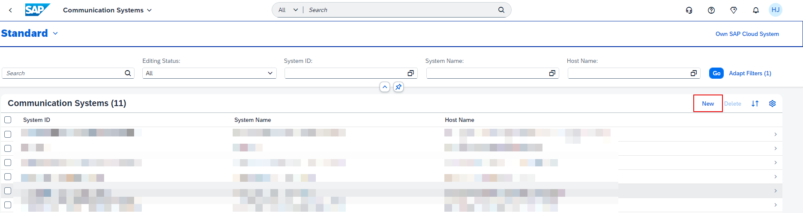

3. Specify a **SystemID** and **System Name** and click **Create**. 
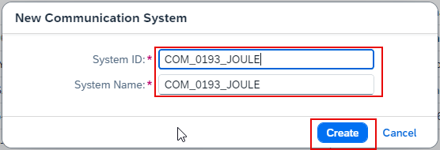

4. In the **Host Name** field, specify your SAP Cloud Identity Services host name. 
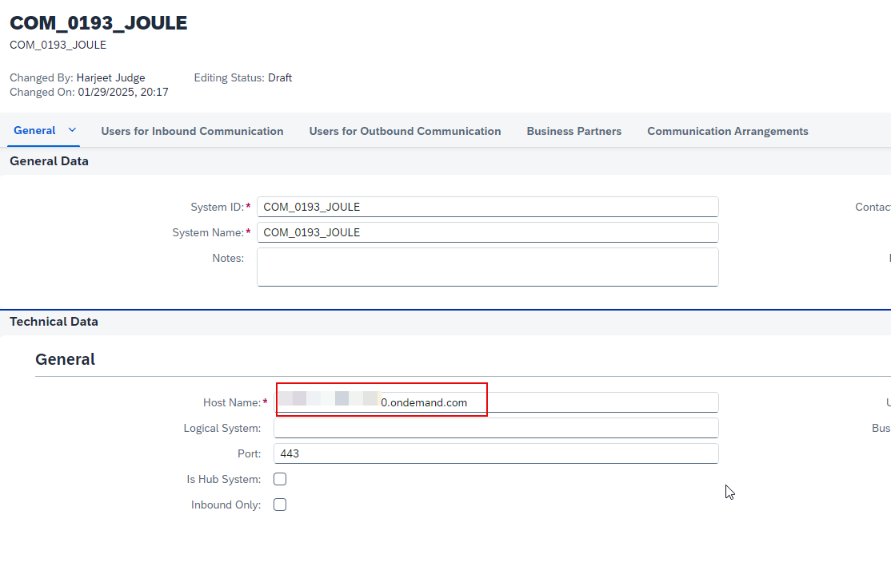

5. Under **Users for Inbound Communication** section, click **+**. 
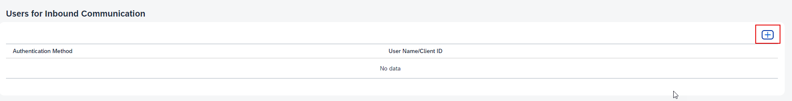

6. Click **New User**. 
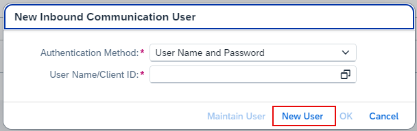

7. Specify and **UserName** and **Description** of your choice.  Either type your own password or use the **Propose Password** button to let the system generate a password.  Make a note of the **UserName** and **Password** as this will be required later for SAP Cloud Identity Provisioning setup.  Click the **Create** button. 
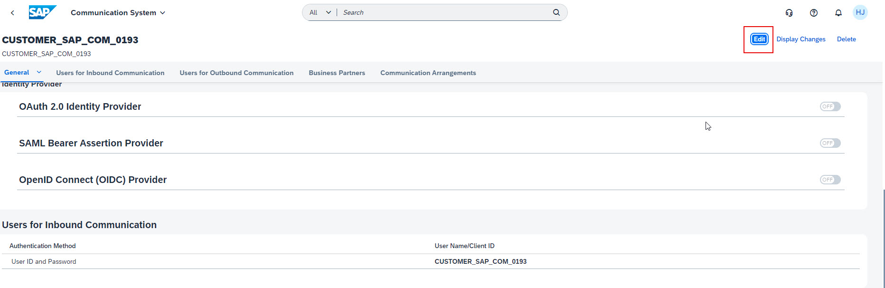

11. Click **OK**. 
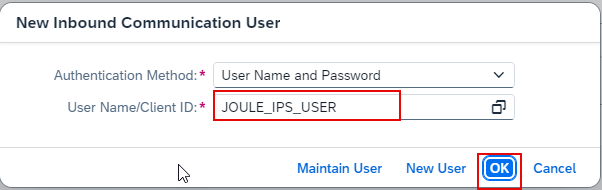

12. Confirm that the user you just created is listed under the **Users for Inbound Communication** area and click **Save**. 
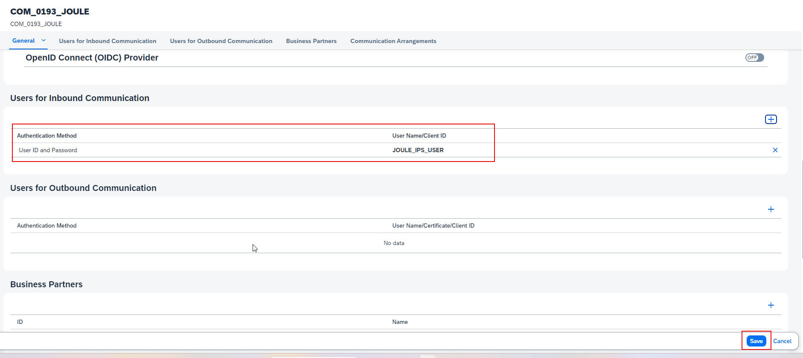

13. Access **Communication Arrangements** application. 
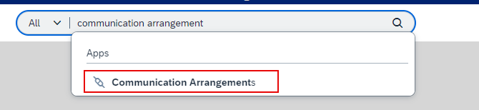

14. Click the **New** button. 
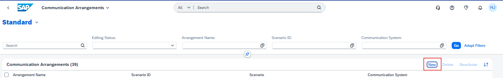

15. For **Scenario**, select **SAP_COM_0193** and specify an **Arrangement Name**. 
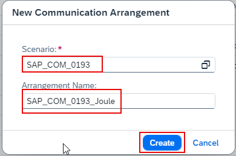

16. For **Communication Systems**, select the communicaton system created earier.  Ensure the **User Name** field is populated with communication user created earlier and click **Save** 
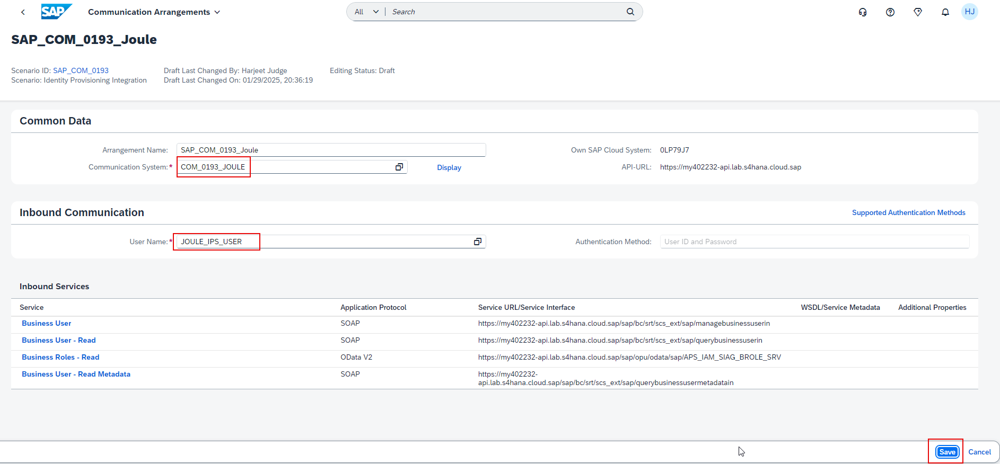
