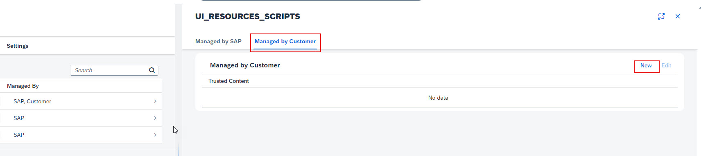

1. Access **Manage Content Security Policy** application in your S/4HANA Cloud system. 
 

2. Navigate to **Trusted Sites** tab and click **Managed By** section for **UI_RESOURCES_SCRIPTS**.
  
   
3. Under **Managed by Customer** tab, click **New**. 

4. Paste the URL of your Joule application into the **Trusted Content** text box and click **Save**. 

