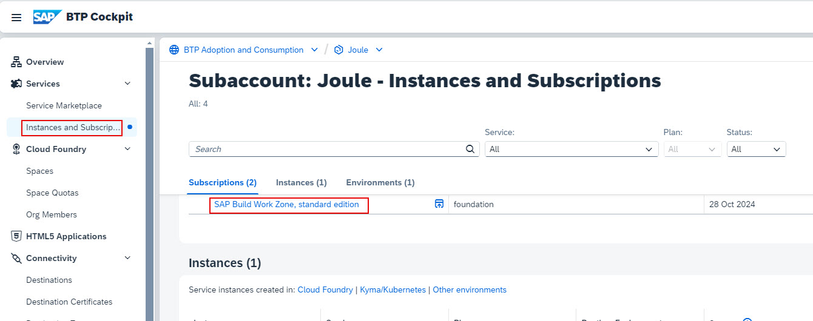

## Check S/4 Cloud Destinations setup in BTP Subaccount
1. Click **Connectivity -> Destinations** and confirm the destinations required for S/4HANA Cloud are successfully created in your BTP Subaccount.  The following 5 destinations should already exist in your BTP subaccount:
  * Designtime Destination
  * Runtime Destinations
    * Runtime Data
    * Runtime Default
  * S4HANA_PUB_SSO
  * NavigationService
    
**NOTE**: The Navigation Service is created manually after the Joule booster execution and the other 4 destinationsare created automatically by the booster.  The names of the Designtime and Runtime destinations are auto generated by the booster and may not match the screenshot shown.  You may also see additional destinations in the list if Joule booster was also executed for other SAP solutions besides S/4HANA Public Cloud

## Check Content Provider in SAP Build Work Zone
**NOTE**: The Joule booster automatically creates a content provider in SAP Build Work Zone using the Runtime and Designtime destinations mentioned above.
1. From the Navigation Pane in BTP Cockpit, select **Security >> Users** and click the arrow to open user details. 
**NOTE**: Make sure to select SAP Cloud Identity User.  User from Default Identity Provider should not be used. 

3. Click **Assign Role Collections**.  
   

4. Select the **Launchpad_Admin** and click **Assign Role Collection**. 
 

5. From the Navigation Pane on the left, select **Instances and Subscriptions***. Click **SAP Build Work Zone, standard edition** to launch the application.   
 

6. Select **Default Identity Provider**. 

1. From the Navigation Pane on the left, select **Instances and Subscriptions***. Click **SAP Build Work Zone, standard edition** to launch the application.   
 

2. Select **Default Identity Provider**. 
 

3. 

