1. Access your S/4HANA Cloud System and launch the **Communication Arrangements** application. 
   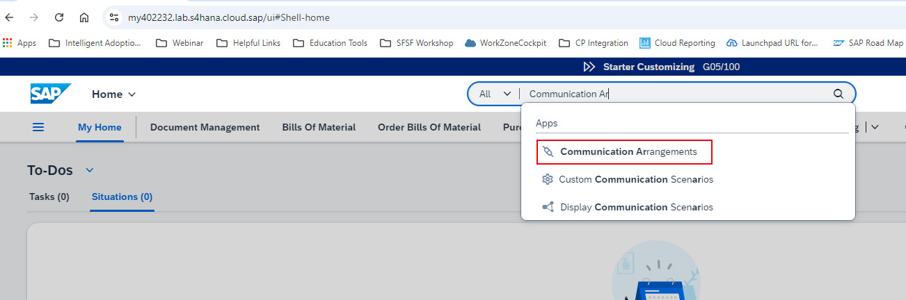
   
2. Confirm that Communication Arrangements with Scenario ID **SAP_COM_0647** and **SAP_COM_0882** are automatically added by the Joule booster. 
   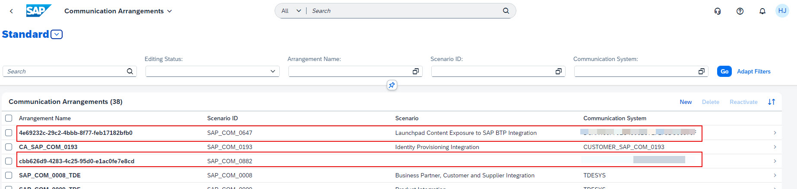
   
3. Click the Communication Arrangement with Scenario ID **SAP_COM_0647** and validate the configuration.  Note that **Exposure Role Selection** is set to **ALL**. 
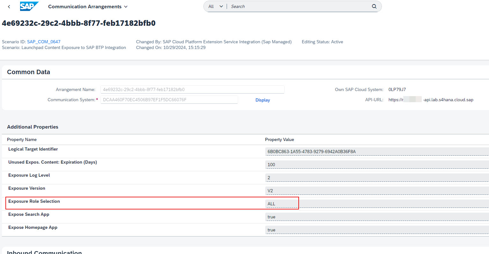

4. Launch the **Communication Systems** application.
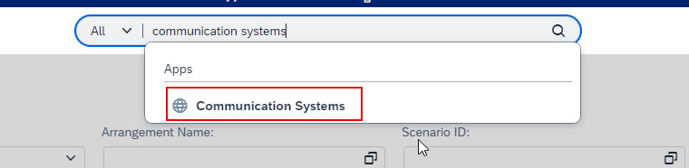

5. Confirm that 4 new Communication Systems are created by the booster.  The System ID and System Names will have cryptic values. 
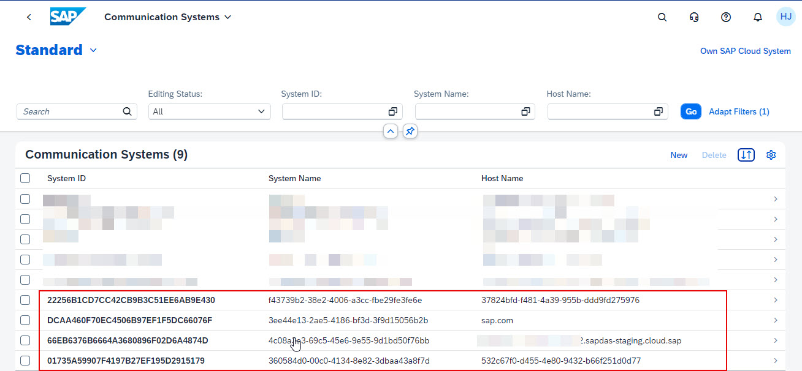

6. Under Communication Systems, select the communication system with the name **CUSTOMER_SAP_COM_0193**.  This system should already be available in your S/4HANA Cloud system. 
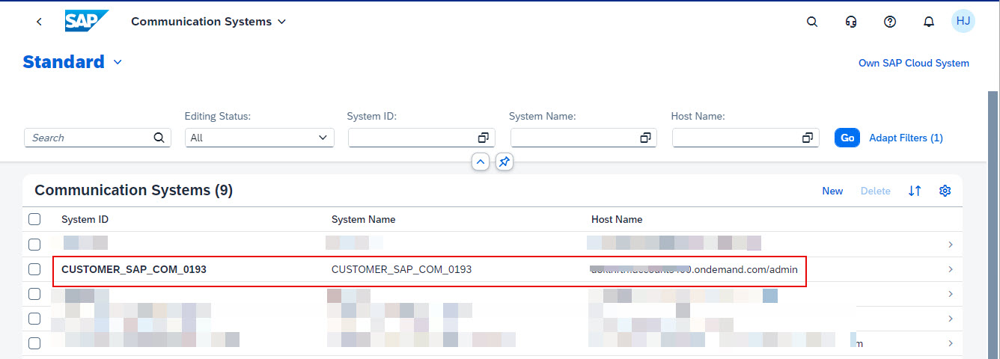

7. Click the **Edit** button. 
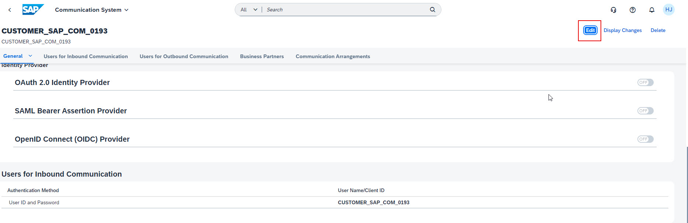

8. Under **Users for Inbount Communication**, click **+** button.
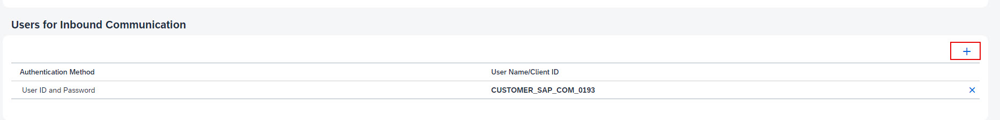

9. Click **New User** button.
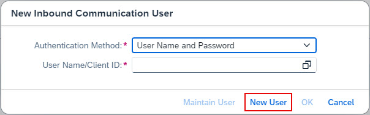

10. Specify and **UserName** and **Description of your choice.  Either type your own password or use the **Propose Password** button to let the system generate a password.  Make a note of the **UserName** and **Password** as this will be required later for SAP Cloud Identity Provisioning setup.  Click the **Create** button.
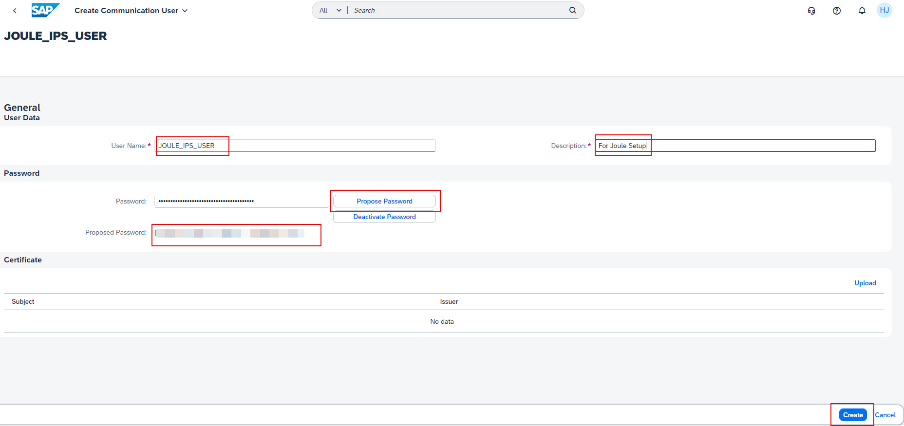

11. Click **OK**.
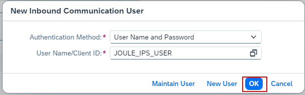

12. Confirm that the user you just created is listed under the **Users for Inbound Communication** area and click **Save**. 
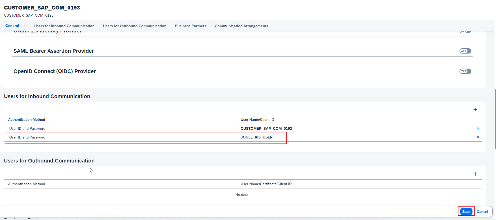
