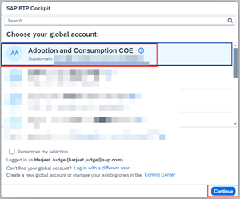
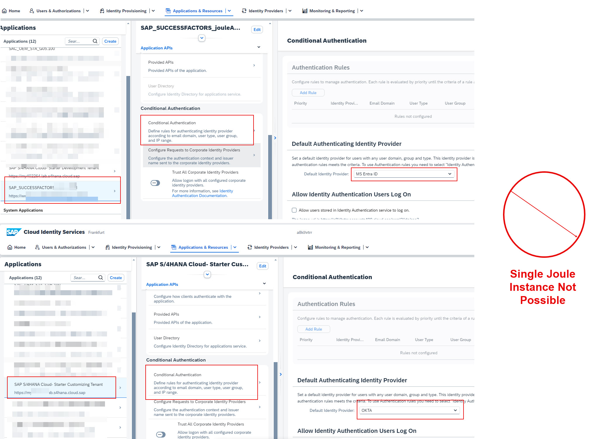

Before you can activate Joule there are certain number of pre-requisites that must be met.  This section describes those pre-requisites and outlines some details that need to be captured prior to running through the activation steps.

## 1. User Personas Required for Joule activation

Activation of Joule requires configuration in multiple systems.  It's important to have the right stakeholders involved when setting up the configuration.  In order to setup Joule the following user personas are required:
* Admins of the system for which Joule will be setup.  For example, SAP SuccessFactors, SAP S/4HANA Cloud Admin etc.
* SAP BTP Global Account Admin
* SAP Cloud Identity Services Admin
  
## 2. Verify Global Account Entitlements

1. Access [BTP Cockpit URL](https://cockpit.btp.cloud.sap).
2. Select the BTP Global Account and click Continue. 
   
3. From the Navigation Panel expand **Entitlements** and click **Service Assignments**.
4. Search for **Joule** and validate that plan below is available.
   
    | Application     | Technical Name | Plan        | Required Quota | Remaining Quota |
    | ----------- | ----------- | ----------- | -------------- | --------------- |
    | Joule      | das-application      | foundation       |     1            |          limited       |
  
    

5. Clear existing search text and search for **SAP Build Work Zone, standard edition**.  Validate that following 2 plans are available for SAP Build Work Zone:

    | Application     | Technical Name | Plan        | Required Quota | Remaining Quota |
    | ----------- | ----------- | ----------- | -------------- | --------------- |
    | SAP Build Work Zone, standard edition   | SAPLaunchpad       | foundation or standard       |      1           |       limited          |
    | SAP Build Work Zone, standard edition      | build-workzone-standard      | foundation or standard      |     1            |          limited       |
  
       
  If the entitlements are not visible, it could be due to one of these reasons:
    1) You don't have licenses for Joule.
    2) Joule entilements were added to different BTP Global Account to which you don't have Global Account Admin access.
    3) The start date for the Joule contract is at future date hence the entilements won't be visible in BTP until that date.

  In the scenarios above, please work with Account Executive, BTP Customer Success Partner or SuccessFactors Customer Success Partner to resolve the entitlements issue prior to proceeding further with this mission.

## 4. Choose Data Center for Joule Setup

Joule is BTP Service that works with multiple SAP solutions.  The number of SAP applications supported with Joule is growing on a regular basis so it's important to choose a data center for Joule setup that can work for various SAP applications that you may have in your landscape - even if those applications are not in scope for Joule setup now.  There are several factors that determine which data center to choose for Joule setup.  Some factors to consider:

1)  What are the currently supported datacenters for Joule?
2)  Which SAP solutions will Joule be setup for and what are datacenters of those solutions?
3)  Are there any legal requirements to choose a datacenter in particular region?
4)  Do you have prefernce for particular hyperscalar such AWS, Azure, Google etc.?

The picture below depicts the process to follow to determine data center selection.
 
For Step 1, review the list of Joule supported data centers from the help page: [Data Centers Supported for Joule](https://help.sap.com/docs/joule/serviceguide/data-centers-supported-by-joule) 
Step 2 requires finding the data centers for the respective applications for which Joule will be setup.  This will be different for each application so refer to specific applicaton documenation to find the respective data centers. 
SuccessFactors: [2089448 - SuccessFactors Data Center Name, Location, Production Login URL, Production Domain Name, External Mail Server Details and Outbound IP addresses](https://me.sap.com/notes/0002089448)
SAP S/4HANA Public Cloud: <Placehoder for documenation link>
IBP Placeholder
PLM Placholder

Let's take a look at a hypthetical scenario shown in the picture below.  In this scenario, majority of the applications are in North American datacenters so it makes sense to choose one of the North American data centers for Joule setup.  The choice between US EAST (VA), US (Virginia), or US Central (IA) is entirely up to you based on your hyperscaler preference. 
 

## 5. Confirm same authentication setup used across SAP applications

To setup a Joule instance that works across different SAP applications the following 3 conditions must be met:
   1) Applications must be integrated with same SAP Cloud Identity Service tenant.
   2) The trust setup between IAS and the SAP applications should be using the same domain.
   3) If using a Corporate Identity Provider, the Conditional Authentication settings for the applications must be setup the same way.

SAP provides a production and non-production instance of SAP Cloud Identity Services free of charge to SAP customers.  All non-prod SAP applications should be integrated with same non-prod Cloud Identity Services tenant and production ones with the production tenant.

SAP Applications for which Joule is being setup for must be integrated with SAP Cloud Identity Services using the same domain.  SAP Cloud Identity Services can use ondemand.com or cloud.sap domain hence it's important that apps that will use the same Joule instance have consistency on domain used to integrate with SAP Cloud Identity Services.  If that's not the case in your environment, then it's not possible to use a single Joule instance that works across different SAP applications.

Furthermore, if your SAP Cloud Identity Authentication is setup to use a Corporate Identity Provider, all of your apps must be configured to use the same Corporate Identity Provider.  For example, if you are planning to run the booster for SAP SuccessFactors and SAP S/4HANA Cloud, the conditional authenticaton settings for both of these apps in SAP Cloud Identity Authenticaton Service should be setup the same way.  If that's not the case in your environment, then it's not possible to use a single Joule instance that works across different SAP applications.  The screenshot below depicts a scenario where SuccessFactors is configured to use MS Entra ID while S/4HANA Cloud is setup to use OKTA.  In this scenario, the applicaitions conditional auth settings do not match, hence unified Joule instance can't be used. 

