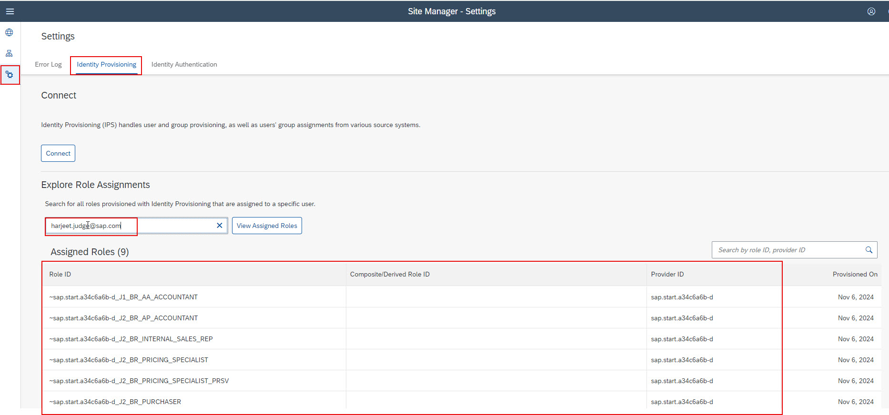

**Note**: In order to run through these steps, you will need to ensure **Launchpad_Admin** role is assigned to the user accessing Work Zone.

1. Access [BTP Cockpit URL](https://cockpit.btp.cloud.sap).
2. Select the BTP Global Account that has the Joule entitlements and click **Continue**.
3. Select the BTP Subaccount where Joule was setup.                        
4. From the Navigation Pane on the left, select **Instances and Subscriptions**. Click **SAP Build Work Zone, standard edition** to launch the application.
6. If prompted for authentication, specify credentials of user in SAP Cloud Identity Services and click **Continue**.
7. Click **Settings >> Identity Provisioning**. Under Explore Role Assignments section, search for user using their email or GlobalUserID(GUID) and click **View Assigned Roles**. 
**Note**: The user should have some roles assigned.  The **Provider id** should match the content provider ID for the SAP S/4HANA Cloud Public Edition system setup by the Joule booster. 

